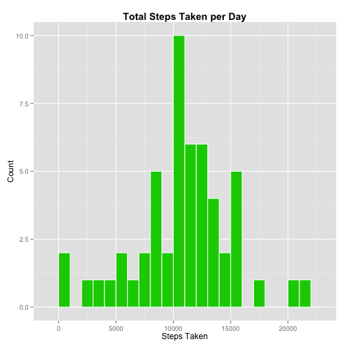
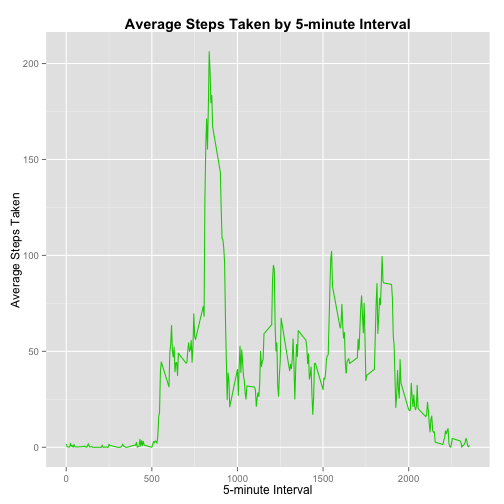
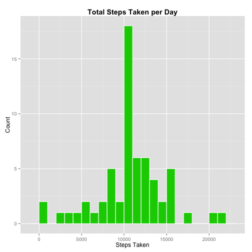
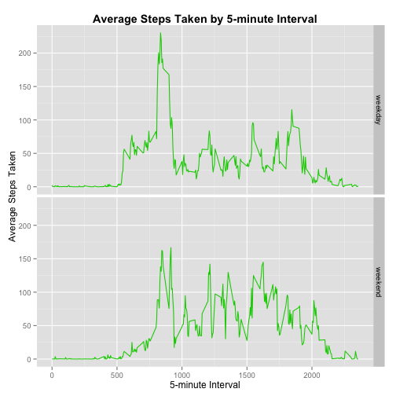

# Reproducible Research: Peer Assessment 1

This assignment makes use of data from a personal activity monitoring device. This device collects data at 5 minute intervals through out the day. The data consists of two months of data from an anonymous individual collected during the months of October and November, 2012 and include the number of steps taken in 5 minute intervals each day.


## Loading and preprocessing the data

Load the data (i.e. read.csv()) and process/transform the data (if necessary) into a format suitable for your analysis

```r
unzip("activity.zip")
data <- read.csv("activity.csv")
dataWihtoutNA <- na.omit(data)
stepdays <- aggregate(dataWihtoutNA["steps"], by = dataWihtoutNA["date"], FUN = sum)
```


## What is mean total number of steps taken per day?

Make a histogram of the total number of steps taken each day


```r
library(ggplot2)

plot1 <- ggplot(stepdays, aes(x = steps)) + geom_histogram(binwidth = 1000, color = "White", fill = "green3") + 
        ggtitle("Total Steps Taken per Day") + theme(plot.title = element_text(face="bold")) + xlab("Steps Taken") + 
        ylab ("Count")

print(plot1)
```

 

Calculate and report the mean and median total number of steps taken per day

**For the total number of steps taken per day:**  


```r
mean_steps = round(mean(stepdays$steps), 2)
median_steps = round(median(stepdays$steps), 2)
```

- **Mean:** 10766.19
- **Median:** 10765


## What is the average daily activity pattern?

Make a time series plot (i.e. type = "l") of the 5-minute interval (x-axis) and the average number of steps taken, averaged across all days (y-axis)


```r
stepsinterval <- aggregate(dataWihtoutNA["steps"], by = dataWihtoutNA["interval"], FUN = mean)

plot2 <- ggplot(stepsinterval, aes(x = interval, y = steps)) + geom_line(color="green3")+ 
        xlab("5-minute Interval") + ylab("Average Steps Taken") + ggtitle("Average Steps Taken by 5-minute Interval") +
        theme(plot.title = element_text(face="bold")) 

print(plot2)
```

 

Which 5-minute interval, on average across all the days in the dataset, contains the maximum number of steps?

```r
index <- with(stepsinterval, which.max(stepsinterval$steps))
max_interval <- stepsinterval[index, "interval"]
```
- **Max Interval:** 835


## Imputing missing values


```r
dataNA <- data[apply(is.na(data), 1, any),]
dataNA$steps <- stepsinterval$steps[match(dataNA$interval, stepsinterval$interval)]
data2 <- rbind(dataNA, dataWihtoutNA) 

stepdays2 <- aggregate(data2["steps"], by = data2["date"], FUN = sum)

plot3 <- ggplot(stepdays2, aes(x = steps)) + geom_histogram(binwidth = 1000,
        color = "White", fill = "green3") + ggtitle("Total Steps Taken per Day") + 
        theme(plot.title = element_text(face="bold")) +
        xlab("Steps Taken") + ylab ("Count")

print(plot3)
```

 

There are a total of **2304** missing values (NA) in the dataset.
The missing step values were filled with the mean value for that 5-minute interval.

After filling in the missing values (the median increased):

- The **mean** total number of steps taken per day is **10766.19**
- The **median** total number of steps taken per day is **10766.19**

```r
round(mean(stepdays2$steps), 2)
round(median(stepdays2$steps), 2)
```


## Are there differences in activity patterns between weekdays and weekends?


```r
data2$weekday1 <- weekdays(as.POSIXlt(data2$date))
for(i in 1:nrow(data2)){
        if(data2$weekday1[i] == "Saturday" | data2$weekday1[i] == "Sunday"){
                data2$weekday[i]  <- "weekend"
        }
        else{
                data2$weekday[i] <- "weekday"
        }
}

weekday_data <- subset(data2[data2$weekday == "weekday", ])
weekend_data <- subset(data2[data2$weekday == "weekend", ])

weekdayinterval <- aggregate(weekday_data["steps"], by = weekday_data["interval"], FUN = mean)
weekday <- rep("weekday",288)
weekdayinterval <- cbind(weekdayinterval, weekday)
weekendinterval <- aggregate(weekend_data["steps"], by = weekend_data["interval"], FUN = mean)
weekday <- rep("weekend", 288)
weekendinterval <- cbind(weekendinterval, weekday)
stepsinterval2 <- rbind(weekdayinterval,weekendinterval)

plot4 <- ggplot(stepsinterval2, aes(x = interval, y = steps)) +
        geom_line(color="green3") + xlab("5-minute Interval") + ylab("Average Steps Taken") + 
        ggtitle("Average Steps Taken by 5-minute Interval") + theme(plot.title = element_text(face="bold")) + 
        facet_grid(weekday ~ .)

print(plot4)
```

 

